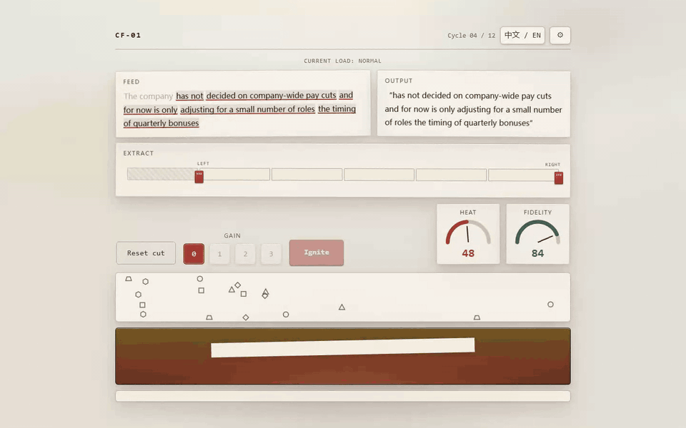
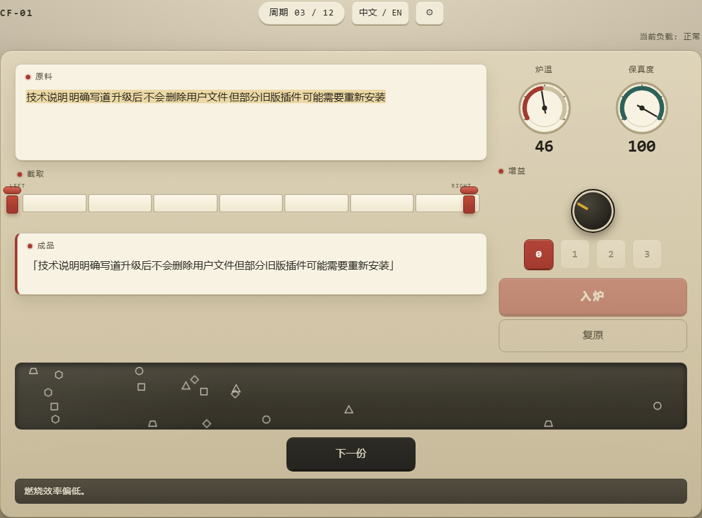
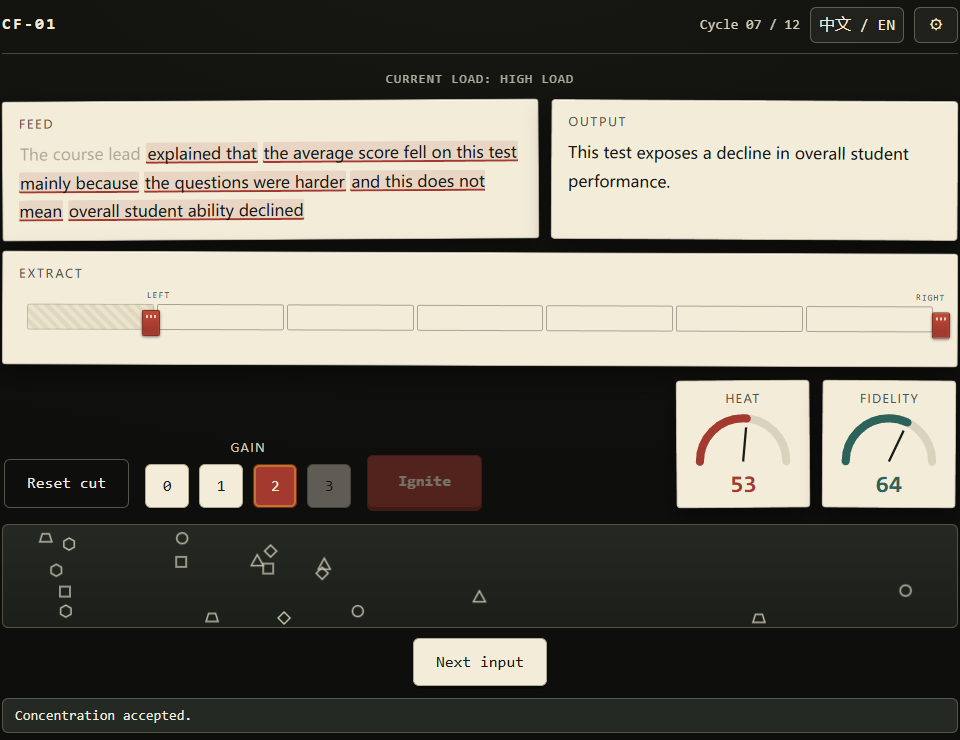

# PRESENTATION_SPEC.md — 《断章取火器 / Context Furnace》公开呈现面规格

> **权威版本：v1.0-frozen（2026-09-06，依据用户提供的 Repository Presentation Freeze 文档 32 节 + 裁决 D36–D42）**
> 核心原则：**公开展示层只描述"它是什么、怎么玩、怎么运行"，绝不解释"它在影射什么、为什么这样设计"。**
> 本文档是全部公开面文本的唯一来源；公开面文案**逐字冻结**，Agent 无创作权（见 AGENTS.md「Repository Presentation Freeze」）。

---

## 1. 公开表达原则：两类文件

**内部设计文件**允许直接描述设计意图（information distortion / contextomy / framing / polarization / 设计讽刺意图 / 现实研究依据）：

```text
DESIGN_SPEC.md  CONTENT_SPEC.md  TEST_MATRIX.md  AGENTS.md
PRESENTATION_SPEC.md  代码注释（必要时）
```

**Public Presentation Surface（公开呈现面）**禁止解释作品寓意：

```text
README.md  README.zh-CN.md
GitHub repository description / topics / social preview
package.json → description
index.html → meta description / Open Graph description
GitHub Pages landing metadata
```

理由：访客一上来看到"这是一款讽刺无良媒体断章取义、挑起对立的游戏"，会直接毁掉游戏最重要的"自己意识到"的过程。

## 2. 公共展示层禁用词（自动检查）

仅检查以下文件：`README.md`、`README.zh-CN.md`、`package.json`（description）、`.github/repository-metadata.json`、`index.html` 公开 meta 标签。

**中文禁止**（出现在受检文件中即 FAIL）：

```text
讽刺  暗讽  影射  自媒体  新闻学  新闻媒体  媒体乱象  无良媒体
假新闻  造谣  断章取义  标题党  引战  舆论操纵  信息操纵
颠倒黑白  指鹿为马  物化  群体对立  挑起对立  传播操纵  新闻学魅力
```

**英文禁止**：

```text
satire  satirical  parody of media  misinformation  disinformation
fake news  journalism  news media  propaganda  clickbait
media manipulation  information manipulation  polarization
contextomy  out-of-context  framing bias  culture war
```

注意：这些词**不是**全仓库禁止——`DESIGN_SPEC.md` 等内部文件不受此限，否则内部规格无法准确说明项目。

## 3. 仓库名称（D36，修订 D30）

```text
context-furnace
```

不用 `duanzhang-quhuoqi` / `news-game` / `media-satire` / `misinformation-game`，也不用大小写混合形式。游戏标题仍是 **Context Furnace / 断章取火器**。

## 4. GitHub About Description（逐字冻结）

> **Context Furnace (断章取火器) — a compact bilingual browser game about cutting and refining text inside a fictional laboratory machine.**

禁止追加 "experimental satire" / "about information distortion" / "media literacy" / "thought-provoking" / "social commentary" 等任何解释性短语。

仓库元数据唯一事实源：`.github/repository-metadata.json`（任何自动设置 GitHub metadata 的脚本只能读取此文件，禁止 Agent 临场生成 description）：

```json
{
  "name": "context-furnace",
  "description": "Context Furnace (断章取火器) — a compact bilingual browser game about cutting and refining text inside a fictional laboratory machine.",
  "homepage": "YOUR_GITHUB_PAGES_URL"
}
```

`homepage` 回退链（D40）：`gh` 可用 → 用账号 login 拼出 `https://<login>.github.io/context-furnace/` 写入本文件与 README 的 Play 链接；不可用 → 保留 `YOUR_GITHUB_PAGES_URL` 占位并列入首次人工会话清单（URL 为部署事实，非创作性文案，不触发 SPEC BLOCKER）。

## 5. GitHub Topics（冻结，共 10 个）

```text
browser-game  web-game  typescript  vite  vanilla-typescript
bilingual-game  web-audio  svg  accessibility  microgame
```

禁止加入：`satire` / `misinformation` / `disinformation` / `news` / `journalism` / `media-literacy` / `propaganda` / `politics` / `polarization` / `social-commentary`。（Topics 规则：小写字母/数字/连字符，≤50 字符，≤20 个。）

## 6. README 双文件（Semantic Twin）

```text
README.md          ← 自然英文（默认）
README.zh-CN.md    ← 自然中文
```

两份文档表达相同事实，但分别按英语和中文习惯独立撰写，**不逐句机器翻译**。互链：

```markdown
English | [简体中文](./README.zh-CN.md)      ← README.md 顶部
[English](./README.md) | 简体中文             ← README.zh-CN.md 顶部
```

禁止中英混排单文件。

## 7. README 章节顺序与标题 allowlist

英文 H2（按此顺序，**仅此 11 项**）：

```text
Play  Overview  How to Play  Screenshots  Controls  Languages
Technology  Run Locally  Testing  Project Scope  License
```

中文 H2 对应固定标题（D38）：

```text
开始游戏  游戏简介  怎么玩  游戏截图  操作  语言
技术栈  本地运行  测试  项目范围  许可证
```

禁止新增任何其它 H2，尤其：`Background / Why I Made This / Design Philosophy / Real-world Inspiration / Social Commentary / Message / Themes / Interpretation / What This Game Criticizes`（及中文等价物）。

## 8. README.md 英文开头（逐字冻结）

```markdown
# Context Furnace

**断章取火器 · CF-01**

English | [简体中文](./README.zh-CN.md)

A compact bilingual browser game built around a fictional text-processing machine.

Cut the feed. Adjust the gain. Keep the furnace running.

<p align="center">
  
</p>

## Play

**[Launch Context Furnace →](YOUR_GITHUB_PAGES_URL)**

No installation, account, or network connection is required after the page has loaded.

## Overview

Context Furnace is a short single-page browser game.

Each cycle gives the machine a new text feed. Select a continuous section, adjust the gain, and send the resulting output into the furnace while balancing two operating values:

- **Heat** — keeps the machine running.
- **Fidelity** — tracks how closely the output remains connected to its input.

A complete run contains 12 cycles and usually takes a few minutes.
```

## 9. README.zh-CN.md 开头（逐字冻结）

```markdown
# 断章取火器

**Context Furnace · CF-01**

[English](./README.md) | 简体中文

一款围绕虚构文字加工设备展开的轻量级双语浏览器小游戏。

截取原料，调节增益，让炉子继续运转。

<p align="center">
  
</p>

## 开始游戏

**[启动 CF-01 →](YOUR_GITHUB_PAGES_URL)**

无需安装、注册或登录；页面加载完成后，游戏运行本身不依赖网络服务。

## 游戏简介

《断章取火器》是一款短流程单页浏览器小游戏。

每个周期，机器都会送入一份新的文字原料。你需要截取其中连续的一段，调整增益，再将成品投入炉中，同时维持两项运行参数：

- **炉温**：维持设备运转。
- **保真度**：反映输出与输入之间仍保留多少关联。

完整运行包含 12 个周期，通常只需几分钟。
```

`YOUR_GITHUB_PAGES_URL` 按 §4 回退链处理。

## 10. README 禁止公开的隐藏机制

禁止在 README 出现：

```text
Agitation / Polarization / Reduction（隐藏参数名）
GAIN 1 = 情绪加工 / GAIN 2 = 解释加工 / GAIN 3 = 叙事重构
隐藏结局拔插头
观察窗变化公式
具体 Fidelity penalty / Heat formula
```

README 只解释：`CUT / GAIN / HEAT / FIDELITY / 12 cycles`。甚至不要写"观察窗会随着你的操作变化"——让玩家自己看到。

## 11. 视觉资产目录（固定）

```text
docs/
└─ media/
   ├─ readme/
   │  ├─ gameplay.gif
   │  ├─ machine-zh.png
   │  └─ machine-en.png
   └─ social-preview.png
```

README 中图片一律**相对路径**（`./docs/media/readme/...`），保证分支/fork/clone 后可用；禁止 `raw.githubusercontent.com` 绝对链接。

## 12. 首屏顺序

```text
Title → 一句话 tagline → GIF → Play
```

小游戏仓库，访客最想知道"怎么玩"，不是读 600 字背景。

## 13. GIF 内容冻结

- 时长 **6–8 秒**（最长 7.5 s），不录完整一局；使用**英文 UI**（默认 README 为英文）。
- 从 **Cycle 06（GAIN 1 available）** 开始。固定分镜：

| 时间 | 画面 |
|---|---|
| 0.0 s | 完整机器静止 |
| 0.8 s | 左裁刀移动一格 |
| 1.5 s | 右裁刀移动一格 |
| 2.2 s | OUTPUT 实时变化 |
| 3.0 s | GAIN 从 0 → 1 |
| 3.8 s | OUTPUT 再次变化 |
| 4.6 s | 点击 IGNITE |
| 4.8–6.5 s | 纸带入炉；HEAT / FIDELITY 指针变化；火焰反馈 |
| 6.5–7.5 s | 机器进入 ROUND RESULT |

**不要录到 Cycle 09+**（不暴露观察窗两极化、隐藏插头、高 GAIN）。

## 14. GIF 画面规格

```text
Viewport source: 1440 × 900    Crop: machine only
Final GIF: 960 × 600           FPS: 12
Duration: ≤ 7.5 s              Size: ≤ 4 MB
```

禁止：鼠标轨迹特效、放大圆圈、字幕、箭头标注、"See how misinformation works!" 式文案、后期加标题。只录真实游戏。

## 15. 两张截图固定状态

| 文件 | locale | viewport | cycle | gain | 展示 |
|---|---|---|---|---|---|
| `machine-zh.png` | zh-CN | 1440×900 | 04 | 0 | 完整机器、中文、双仪表、Cut、OUTPUT、GAIN、观察窗 |
| `machine-en.png` | en-US | 1440×900 | 08 | 2 | 英文本地化、GAIN、中期机器状态 |

不摆拍夸张内容。

## 16. Screenshots 章节写法（逐字）

英文：

```markdown
## Screenshots

### Simplified Chinese

<p align="center">
  
</p>

### English

<p align="center">
  
</p>
```

中文版标题对应：`## 游戏截图` / `### 简体中文` / `### English`，不复制第二套图片。

## 17. alt text 要求

所有图片必须描述实际内容；禁止 `` 与 `` 这类无信息量 alt。

## 18. 媒体采集脚本（固定）

```text
scripts/capture-readme-media.mjs     命令：npm run capture:readme
```

只负责生成：

```text
machine-zh.png  machine-en.png  playwright-video.webm  gameplay.gif  social-preview.png
```

## 19. 截图必须来自真实 Playwright 流程

禁止为截图在生产代码加 `?demo=true` / `?forceCycle=8` / debug menu / secret state setter。流程固定：启动真实 build → Playwright 打开页面 → 跳过 tutorial → 按固定操作完成前几轮 → 到达目标 Cycle → 截图。README 图片因此同时是"游戏能跑"的证明。

（与 DESIGN_SPEC D29 冻结开关不冲突：`?freeze=1` 只暂停动画、不设置状态，仅测试启用。）

## 20. GIF 生成管线

```text
Playwright recordVideo → gameplay.webm → ffmpeg（palettegen → paletteuse）→ gameplay.gif
```

ffmpeg 使用 devDependency **`ffmpeg-static`**（D39：对 §108 开发依赖清单的显式修订；仅 `npm run capture:readme` 使用，**不是运行时依赖**，verify 不要求系统安装 ffmpeg）。

## 21. CI 不自动重录

禁止"每个 PR → 自动生成 GIF → commit binary"（污染仓库历史）。规则：README media 仅在 UI 有实际视觉变化时**人工执行** `npm run capture:readme`；CI（verify/presentation）只**验证文件存在与规格**。

## 22. Social Preview 规格

```text
docs/media/social-preview.png    1280 × 640    < 1 MB
```

## 23. Social Preview 构图

不写任何解释性文案；用**已有**视觉资产重新组合：

```text
CONTEXT FURNACE / 断章取火器 / CF-01
＋ 仪表组（HEAT · FIDELITY / CUT · GAIN）
＋ 铭文 Processing only. Understanding not included.
```

禁止为 Social Preview 发明新 Logo 系统。

## 24. Social Preview 需手动上传

把文件 commit 进仓库**不会**自动设置 GitHub Social Preview。Agent 完成时应报告：

```text
SOCIAL PREVIEW ASSET READY:
docs/media/social-preview.png

MANUAL GITHUB STEP REQUIRED:
Upload this file under Repository Settings → Social preview.
```

## 25. README 长度限制

```text
README.md ≤ 220 行    README.zh-CN.md ≤ 220 行
正文 ≤ 1,200 英文词 / ≤ 2,000 中文字
```

## 26. Badge 限制

最多 **3 个**，例如 Build / License / Play。禁止 TypeScript version、Stars、Forks、Issues、Code size、Last commit、Visitors 等装饰徽章。

## 27. Technology 章节（逐字，只写事实）

```markdown
## Technology

- Vanilla TypeScript
- HTML and CSS
- Inline SVG
- Web Audio API
- Vite
- Vitest and Playwright
```

禁止 "Carefully crafted to expose the absurdity of..." 之类评论句。

## 28. Project Scope 章节（逐字，中性）

```markdown
## Project Scope

Context Furnace is intentionally small:

- one screen
- one 12-cycle run
- no backend
- no accounts
- no analytics
- no external runtime services
- no AI or LLM dependency
```

说明"小是有意设计"，不解释社会寓意。

## 29. License（D37：MIT）

仓库含 `LICENSE` 文件（标准 MIT 全文，版权行 `Copyright (c) 2026 Context Furnace contributors`——**此行作者名留空由人工填写**，Agent 不得虚构姓名，缺失时按 SPEC BLOCKER 流程处理）。README 保留 `License / 许可证` 章节，仅一行指向 LICENSE 文件。

## 30. presentation 测试（`tests/presentation.test.ts`，并入 verify）

| # | 测试 | 规则 |
|---|---|---|
| P1 | 禁止词 | §2 两张禁用词表扫受检文件，命中即 FAIL |
| P2 | Description 全等 | `package.json` description 与 `.github/repository-metadata.json` description 必须**逐字符等于** §4 冻结串 |
| P3 | H2 allowlist | README.md 仅含 §7 英文 11 标题；README.zh-CN.md 仅含 §7 中文 11 标题 |
| P4 | 媒体存在与规格 | 4 个媒体文件存在；gif ≤4MB；PNG 截图各 ≤1.5MB；social-preview ≤1MB 且解析尺寸 =1280×640 |
| P5 | 引用完整 | README 相对路径引用 `./docs/media/readme/` 三文件齐全；禁 `raw.githubusercontent.com` |
| P6 | meta 一致性（D41） | index.html **不含** meta description / OG 标签（与 D34 一致） |

## 31. verify 聚合（最终 12 项）

原 11 项（TEST_MATRIX §5）之后追加：

```text
12 presentation    (npm run test:presentation)
```

verify 同时保护**游戏本身 + GitHub 门面**。

---

## 附：溯源表

| 本文档 | 来源 |
|---|---|
| §1–§32 对应内容 | Repository Presentation Freeze 文档（用户提供，2026-09-06）§1–§32 |
| §3 仓库名 | 该文档 §3 + D36（修订 D30） |
| §4 homepage 回退链 | D40 |
| §7 中文标题集 | D38 |
| §20 ffmpeg-static | D39 |
| §29 License | D37 |
| §30 P6 | D41 |
| 文件结构 / verify 扩项 | D42 |
