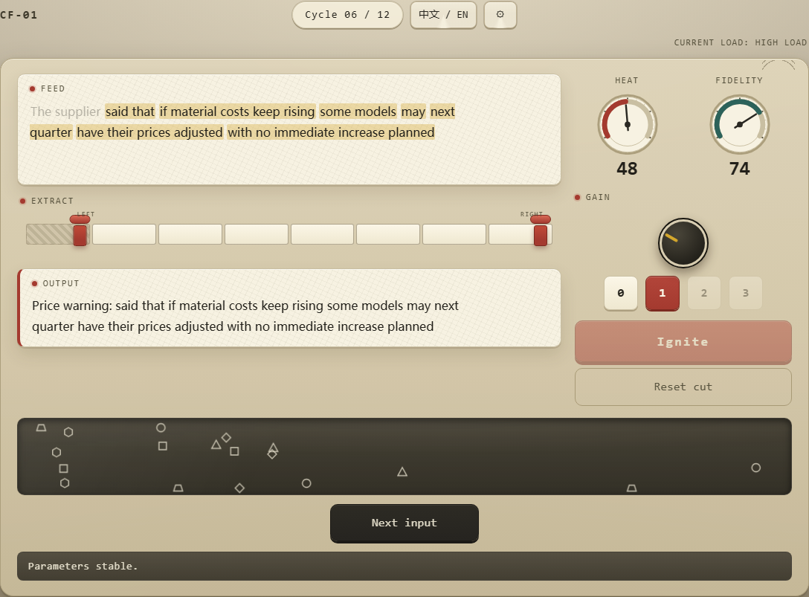
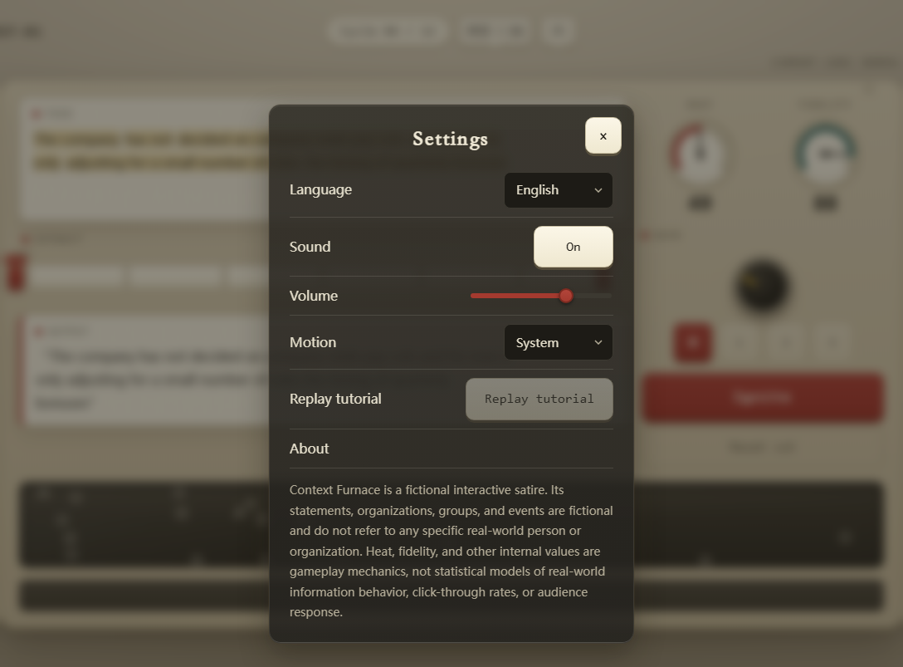
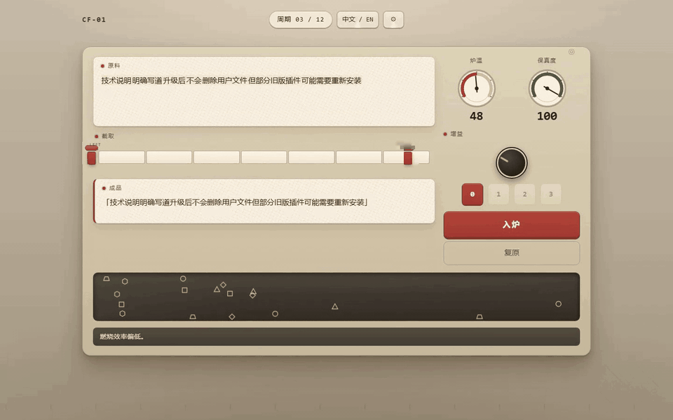

# PRESENTATION_SPEC.md — 《断章取火器 / Context Furnace》公开呈现面规格

> **权威版本：v1.2-frozen（2026-09-09）**
> 核心原则：**公开展示层只描述"它是什么、怎么玩、怎么运行"，绝不解释"它在影射什么、为什么这样设计"。**
> 本文档是全部公开面文本的唯一来源；公开面文案**逐字冻结**，Agent 无创作权（见 AGENTS.md「Repository Presentation Freeze」）。
>
> **v1.1 修订记录（2026-09-07，用户人工指示授权）**：README 双语重构——按主流开源仓库惯例引入居中头部块（头图 + 徽章 + 语言切换），并要求**各语言版本的截图与 GIF 一一对应**。具体变更：§8/§9 开头冻结块更新（正文文案不变，仅重排版并新增头图与徽章）；§11 资产清单新增 `boot-zh.png`、`boot-en.png`、`gameplay-zh.gif`；§12 首屏顺序更新；§13 GIF 按语言各录一份；§15 新增 boot 头图采集状态；§18 采集脚本产物更新；§26 徽章定为 Play / CI / License 三个；§30 P4/P5 规则同步。§2 禁用词、§4 Description、§5 Topics、§7 H2 白名单、§10 隐藏机制、§27/§28 逐字章节等其余条款**不变**。
>
> v1.0 原始冻结依据：用户提供的 Repository Presentation Freeze 文档 32 节 + 裁决 D36–D42（2026-09-06）。
>
> **v1.1.1（2026-09-07，所有者卫生裁定）**：§2 受检词汇清单不再以明文形式收录于公开文档，改由 P1 检查器以编码 fixtures 运行期物化；清单内容与 v1.0 逐字一致，扫描面与 FAIL 行为不变。
>
> **v1.2 修订记录（2026-09-09，用户人工指示授权）**：README 展示密度升级——Screenshots 章节改为**双列网格**（图宽 470，消除竖排堆叠与宽屏两侧留白），新增四张真实流程截图（`settings-zh.png`、`settings-en.png`、`result-zh.png`、`result-en.png`）与两条**语言切换 GIF**（`switch-en.gif`、`switch-zh.gif`，置于 Languages 章节末尾），Controls 章节表格化。具体变更：§11 资产清单新增 6 文件并明确语言对应；§13 新增语言切换 GIF 分镜（§13-2）；§15 新增 4 行固定采集状态；§16 逐字块整体替换（Screenshots 网格 / Controls 表格 / Languages 配图，中英各一套）；§18 采集脚本产物更新；§30 P4/P5 规则同步。§2 禁用词、§4 Description、§5 Topics、§7 H2 白名单、§8/§9 头部块、§12 首屏顺序、§25 长度限制（v1.2 版式实测 ≤ 220 行）、§26 徽章（仍 3 个）、§10 隐藏机制、§27/§28 逐字章节等其余条款**不变**。
>
> **v1.2.1（2026-09-09，视觉精修，同轮用户指示）**：§16-1 网格表格标签补 `align="center"`；§15 `settings-*` 采集裁剪统一为 1088×803 画幅（编辑态机身天然 738px 高，上下对称补边），使网格四图等高、行底边对齐。依据：GitHub 生产环境对 HTML 表格按 `width:max-content` 收缩且默认贴左（线上实测无 align 的表格中心偏离内容区中心 ~170–200px，与居中头部块形成可见偏移），`align="center"` 经 Markdown API 验证可原样生还 sanitizer，并在 Sniffnet / Dashy 等热门仓库线上 README 实测居中生效。
>
> **v1.2.2（2026-09-09，居中双保险，同轮用户指示）**：§16-1 网格表格再外套 `<div align="center">`，与表格 `align="center"` 构成双保险（前者覆盖剥离 table align 的渲染器，后者覆盖 GitHub 生产表格行为）。经 Markdown API 验证双层标记均生还 sanitizer；Dashy 线上同款网格（table align + td align + 图注）实测 center=564=内容区中心、三图中心严格对称。全部截图与 GIF 所在容器核对：头部块（boot 图 / 徽章 / gameplay GIF）在 `<div align="center">` 内，Languages 的 switch GIF 在 `<p align="center">` 内——均为 Astro / Shields / Oh My Zsh / Sniffnet 等热门仓库的主流居中写法。
>
> **v1.2.3（2026-09-09，图廊去表格化，用户人工指示）**：§16-1 图廊由「双列表格」改造为「**居中段落 + 百分比宽度 ``**」——`<p align="center">` 内四张 `width="47%"` 图片自动两两成行（Sniffnet 画廊范式），随内容宽自适应、任何渲染器下天然居中，彻底摆脱 GitHub 表格 `width:max-content` 收缩/贴左行为。可见图注（`<sub>`）取消：sanitizer 剥离 style，纯段落流中逐图图注无法与图片对位；语言与周期信息并入 alt 文本（§17）。媒体清单、采集状态、语言对应关系（§11/§15/P5）不变。
>
> **v1.2.4（2026-09-09，图廊行级图注版式，用户人工指示）**：§16-1 图廊定稿为「**行级居中图注 + 单行 48.8% 双图**」——每组图片上方一行居中加粗图注（`<b>A</b> · <b>B</b>`），图片行由单个 `<p align="center">` 内两张 `width="48.8%"` 图片构成（合计 97.6%，行宽近满、两侧边距 ≈1%，行内两图中心连线关于内容中线严格对称）。相对 v1.2.3 的 47% 方案：边距从 ~2.4% 收窄至 ~1%，消除与左对齐章节标题之间的缩进观感；恢复可见图注（行级居中，规避逐图对位问题）。图注术语与 CONTENT_SPEC 一致。

---

## 1. 公开表达原则：两类文件

**内部设计文件**允许直接描述设计意图（information distortion / contextomy / framing / polarization / 设计讽刺意图 / 现实研究依据）：

```text
DESIGN_SPEC.md  CONTENT_SPEC.md  TEST_MATRIX.md  AGENTS.md
PRESENTATION_SPEC.md  代码注释（必要时）
```

**Public Presentation Surface（公开呈现面）**禁止解释作品寓意：

```text
README.md  README.zh-CN.md
GitHub repository description / topics / social preview
package.json → description
index.html → meta description / Open Graph description
GitHub Pages landing metadata
```

理由：访客一上来看到"这是一款讽刺无良媒体断章取义、挑起对立的游戏"，会直接毁掉游戏最重要的"自己意识到"的过程。

## 2. 公共展示层禁用词（自动检查）

仅检查以下文件：`README.md`、`README.zh-CN.md`、`package.json`（description）、`.github/repository-metadata.json`、`index.html` 公开 meta 标签。

受检词汇的具体清单**不以明文形式收录于本仓库任何公开文档**（v1.1.1 所有者卫生裁定）：清单由 `tests/presentation.test.ts` 的 P1 检查器以编码 fixtures 携带、运行期物化，本节仅冻结其语义边界——

- 中文与英文各一张等价词表，覆盖四类语义：对创作意图的定性指控、对特定行业的蔑称、对信息行为的不实定性、对操纵行为的直接命名；
- 任何一侧词汇在受检文件中出现即 FAIL；
- 两张词表的内容与 v1.0 冻结版逐字一致，后续如需调整须走所有者裁决。

注意：这些词**不是**全仓库禁止——`DESIGN_SPEC.md` 等内部文件不受此限，否则内部规格无法准确说明项目。

## 3. 仓库名称（D36，修订 D30）

```text
context-furnace
```

不用 `duanzhang-quhuoqi` / `news-game` / `media-satire` / `misinformation-game`，也不用大小写混合形式。游戏标题仍是 **Context Furnace / 断章取火器**。

## 4. GitHub About Description（逐字冻结）

> **Context Furnace (断章取火器) — a compact bilingual browser game about cutting and refining text inside a fictional laboratory machine.**

禁止追加 "experimental satire" / "about information distortion" / "media literacy" / "thought-provoking" / "social commentary" 等任何解释性短语。

仓库元数据唯一事实源：`.github/repository-metadata.json`（任何自动设置 GitHub metadata 的脚本只能读取此文件，禁止 Agent 临场生成 description）：

```json
{
  "name": "context-furnace",
  "description": "Context Furnace (断章取火器) — a compact bilingual browser game about cutting and refining text inside a fictional laboratory machine.",
  "homepage": "YOUR_GITHUB_PAGES_URL"
}
```

`homepage` 回退链（D40）：`gh` 可用 → 用账号 login 拼出 `https://<login>.github.io/context-furnace/` 写入本文件与 README 的 Play 链接；不可用 → 保留 `YOUR_GITHUB_PAGES_URL` 占位并列入首次人工会话清单（URL 为部署事实，非创作性文案，不触发 SPEC BLOCKER）。

## 5. GitHub Topics（冻结，共 10 个）

```text
browser-game  web-game  typescript  vite  vanilla-typescript
bilingual-game  web-audio  svg  accessibility  microgame
```

禁止加入：`satire` / `misinformation` / `disinformation` / `news` / `journalism` / `media-literacy` / `propaganda` / `politics` / `polarization` / `social-commentary`。（Topics 规则：小写字母/数字/连字符，≤50 字符，≤20 个。）

## 6. README 双文件（Semantic Twin）

```text
README.md          ← 自然英文（默认）
README.zh-CN.md    ← 自然中文
```

两份文档表达相同事实，但分别按英语和中文习惯独立撰写，**不逐句机器翻译**。互链：

```markdown
English | [简体中文](./README.zh-CN.md)      ← README.md 顶部
[English](./README.md) | 简体中文             ← README.zh-CN.md 顶部
```

禁止中英混排单文件。

## 7. README 章节顺序与标题 allowlist

英文 H2（按此顺序，**仅此 11 项**）：

```text
Play  Overview  How to Play  Screenshots  Controls  Languages
Technology  Run Locally  Testing  Project Scope  License
```

中文 H2 对应固定标题（D38）：

```text
开始游戏  游戏简介  怎么玩  游戏截图  操作  语言
技术栈  本地运行  测试  项目范围  许可证
```

禁止新增任何其它 H2，尤其：`Background / Why I Made This / Design Philosophy / Real-world Inspiration / Social Commentary / Message / Themes / Interpretation / What This Game Criticizes`（及中文等价物）。

## 8. README.md 英文开头（v1.1 冻结块，逐字）

```markdown
<div align="center">

# Context Furnace

**断章取火器 · CF-01**

A compact bilingual browser game built around a fictional text-processing machine.


[](https://rethymus.github.io/context-furnace/)
[](https://github.com/Rethymus/context-furnace/actions/workflows/ci.yml)
[](./LICENSE)

English | [简体中文](./README.zh-CN.md)

*Cut the feed. Adjust the gain. Keep the furnace running.*


</div>
```

紧随其后的 `## Play` / `## Overview` 正文沿用 v1.0 冻结文案不变；Overview 末尾新增速览表（v1.1，逐字）：

```markdown
| | |
|---|---|
| **Session** | 12 cycles · a few minutes |
| **Languages** | 简体中文 · English |
| **Input** | Mouse, touch, or keyboard |
| **Audio** | Synthesized in the browser (Web Audio) — no audio files |
```

## 9. README.zh-CN.md 开头（v1.1 冻结块，逐字）

```markdown
<div align="center">

# 断章取火器

**Context Furnace · CF-01**

一款围绕虚构文字加工设备展开的轻量级双语浏览器小游戏。


[](https://rethymus.github.io/context-furnace/)
[](https://github.com/Rethymus/context-furnace/actions/workflows/ci.yml)
[](./LICENSE)

[English](./README.md) | 简体中文

*截取原料，调节增益，让炉子继续运转。*


</div>
```

紧随其后的 `## 开始游戏` / `## 游戏简介` 正文沿用 v1.0 冻结文案不变；游戏简介末尾新增速览表（v1.1，逐字）：

```markdown
| | |
|---|---|
| **流程** | 12 个周期 · 几分钟 |
| **语言** | 简体中文 · English |
| **操作** | 鼠标 / 触摸 / 键盘 |
| **音频** | 浏览器内实时合成（Web Audio），无音频文件 |
```

## 10. README 禁止公开的隐藏机制

禁止在 README 出现：

```text
Agitation / Polarization / Reduction（隐藏参数名）
GAIN 1 = 情绪加工 / GAIN 2 = 解释加工 / GAIN 3 = 叙事重构
隐藏结局拔插头
观察窗变化公式
具体 Fidelity penalty / Heat formula
```

README 只解释：`CUT / GAIN / HEAT / FIDELITY / 12 cycles`。甚至不要写"观察窗会随着你的操作变化"——让玩家自己看到。

## 11. 视觉资产目录（固定，v1.1）

```text
docs/
└─ media/
   ├─ readme/
   │  ├─ gameplay.gif        ← 英文 UI（README.md）
   │  ├─ gameplay-zh.gif     ← 中文 UI（README.zh-CN.md）
   │  ├─ switch-en.gif       ← 英文 UI 起始的语言切换演示（README.md，v1.2）
   │  ├─ switch-zh.gif       ← 中文 UI 起始的语言切换演示（README.zh-CN.md，v1.2）
   │  ├─ boot-en.png         ← 英文启动界面头图（README.md）
   │  ├─ boot-zh.png         ← 中文启动界面头图（README.zh-CN.md）
   │  ├─ machine-zh.png
   │  ├─ machine-en.png
   │  ├─ settings-en.png     ← 英文设置面板（README.md，v1.2）
   │  ├─ settings-zh.png     ← 中文设置面板（README.zh-CN.md，v1.2）
   │  ├─ result-en.png       ← 英文 ROUND RESULT（README.md，v1.2）
   │  └─ result-zh.png       ← 中文 ROUND RESULT（README.zh-CN.md，v1.2）
   └─ social-preview.png
```

各语言版本的截图与 GIF 必须与该语言**一一对应**：README.md 只用英文 UI 动图与英文头图，README.zh-CN.md 只用中文 UI 动图与中文头图；`machine-zh.png` / `machine-en.png` 两张游戏截图在两份 README 中均展示（§16）；v1.2 新增的 `settings-*`、`result-*`、`switch-*` 同样按语言一一对应——README.md 用 `-en` 版本，README.zh-CN.md 用 `-zh` 版本。

README 中图片一律**相对路径**（`./docs/media/readme/...`），保证分支/fork/clone 后可用；禁止 `raw.githubusercontent.com` 绝对链接。

## 12. 首屏顺序（v1.1）

```text
Title 块（H1 · 副标题 · 一句话简介 · 头图 · 徽章 · 语言切换） → tagline → 语言对应 GIF → Play
```

小游戏仓库，访客最想知道"怎么玩"，不是读 600 字背景。

## 13. GIF 内容冻结（v1.1：按语言各录一份）

- `gameplay.gif` 使用**英文 UI**（README.md）；`gameplay-zh.gif` 使用**中文 UI**（README.zh-CN.md）。分镜、时长、规格完全相同。
- 时长 **6–8 秒**（最长 7.5 s），不录完整一局。
- 从 **Cycle 06（GAIN 1 available）** 开始。固定分镜：

| 时间 | 画面 |
|---|---|
| 0.0 s | 完整机器静止 |
| 0.8 s | 左裁刀移动一格 |
| 1.5 s | 右裁刀移动一格 |
| 2.2 s | OUTPUT 实时变化 |
| 3.0 s | GAIN 从 0 → 1 |
| 3.8 s | OUTPUT 再次变化 |
| 4.6 s | 点击 IGNITE |
| 4.8–6.5 s | 纸带入炉；HEAT / FIDELITY 指针变化；火焰反馈 |
| 6.5–7.5 s | 机器进入 ROUND RESULT |

**不要录到 Cycle 09+**（不暴露观察窗两极化、隐藏插头、高 GAIN）。

### 13-2. 语言切换 GIF 分镜（v1.2：switch-en.gif / switch-zh.gif）

- `switch-en.gif` 以**英文 UI 起始**（README.md），`switch-zh.gif` 以**中文 UI 起始**（README.zh-CN.md）；两条分镜互为镜像，其余规则与 §13 相同。
- 时长 **4.5–5.5 秒**；画面规格与 §14 一致（960×600 / 12 fps / ≤ 4 MB）。
- 从 **Cycle 03 编辑态**开始（GAIN 尚未解锁，界面最安静）。固定分镜：

| 时间 | 画面 |
|---|---|
| 0.0–0.9 s | Cycle 03 编辑态静止（起始语言 UI） |
| 1.0 s | 点击头部「中文 / EN」按钮 |
| 1.1–2.9 s | 全界面文案切换为另一语言（轨道、仪表、按钮、标题、页签） |
| 3.2 s | 再次点击「中文 / EN」按钮 |
| 3.3–5.0 s | 界面切回起始语言 |
| 5.0–5.5 s | 静止收尾 |

**不出现 Cycle 09+、GAIN ≥ 1 与观察窗特写**（剧透边界与 §10/§13 一致）。

## 14. GIF 画面规格

```text
Viewport source: 1440 × 900    Crop: machine only
Final GIF: 960 × 600           FPS: 12
Duration: ≤ 7.5 s              Size: ≤ 4 MB
```

`switch-en.gif` / `switch-zh.gif`（v1.2）规格同上，仅时长 **4.5–5.5 s**（§13-2）。

禁止：鼠标轨迹特效、放大圆圈、字幕、箭头标注、"See how misinformation works!" 式文案、后期加标题。只录真实游戏。

## 15. 截图与头图固定状态

| 文件 | locale | viewport | cycle | gain | 展示 |
|---|---|---|---|---|---|
| `boot-zh.png` | zh-CN | 1440×900 | 00（上电前） | — | 启动界面标题卡：断章取火器 · 启动按钮 |
| `boot-en.png` | en-US | 1440×900 | 00（上电前） | — | 启动界面标题卡：Context Furnace · Power on |
| `machine-zh.png` | zh-CN | 1440×900 | 04 | 0 | 完整机器、中文、双仪表、Cut、OUTPUT、GAIN、观察窗 |
| `machine-en.png` | en-US | 1440×900 | 08 | 2 | 英文本地化、GAIN、中期机器状态 |
| `settings-zh.png` | zh-CN | 1440×900（裁 machine 区域，统一 1088×803 画幅） | 04 | 0 | 设置面板开启：语言 / 声音 / 音量 / 动效 / 重播教学 / 关于（v1.2） |
| `settings-en.png` | en-US | 1440×900（裁 machine 区域，统一 1088×803 画幅） | 04 | 0 | 设置面板开启（英文本地化）（v1.2） |
| `result-zh.png` | zh-CN | 1440×900 | 06 | 1 | ROUND_RESULT：机器消息 +「下一份」按钮，双仪表已更新（v1.2） |
| `result-en.png` | en-US | 1440×900 | 06 | 1 | ROUND_RESULT（英文本地化）（v1.2） |

头图为真实启动界面截取（等比缩放展示，宽 560），不是新造的 Logo 系统。不摆拍夸张内容。

## 16. Screenshots / Controls / Languages 章节写法（v1.2 逐字）

### 16-1. Screenshots 图廊（取代 v1.1 的 H3 竖排块；**行级居中图注 + 单行 48.8% 双图**，v1.2.4）

版式结构（每行图片组）：居中加粗图注行（`<b>A</b> · <b>B</b>` 对应该行两张图）→ 单个 `<p align="center">` 内两张 `width="48.8%"` 图片（同一行、单个空格分隔）。48.8% × 2 = 97.6%，图片行几乎占满内容宽、两侧边距 ≈1%，行内两图中心连线关于内容中线严格对称；图注按行居中，规避逐图图注对位问题。

英文（README.md）：

```markdown
## Screenshots

<p align="center"><b>Simplified Chinese</b> · <b>English</b></p>
<p align="center"> </p>
<p align="center"><b>Round result</b> · <b>Settings</b></p>
<p align="center"> </p>
```

中文（README.zh-CN.md，第二组换成本语言截图与图注）：

```markdown
## 游戏截图

<p align="center"><b>简体中文</b> · <b>English</b></p>
<p align="center"> </p>
<p align="center"><b>入炉结果</b> · <b>设置</b></p>
<p align="center"> </p>
```

### 16-2. Controls 表格（取代 v1.1 的 bullet 版；文案事实不变，仅改排版）

英文：

```markdown
## Controls

| Input | Action |
|---|---|
| **Mouse / touch** | Drag the cutters, tap a track edge, or tap a gain stop |
| <kbd>Tab</kbd> | Move focus |
| <kbd>←</kbd> / <kbd>→</kbd> | Move a focused cutter or the gain |
| <kbd>Enter</kbd> / <kbd>Space</kbd> | Activate |
| <kbd>Esc</kbd> | Close settings |

Sound and motion can be adjusted in Settings.
```

中文：

```markdown
## 操作

| 输入 | 动作 |
|---|---|
| **鼠标 / 触摸** | 拖动裁刀、点击轨道边界，或直接点击增益卡位 |
| <kbd>Tab</kbd> | 移动焦点 |
| <kbd>←</kbd> / <kbd>→</kbd> | 移动聚焦的裁刀或增益档位 |
| <kbd>Enter</kbd> / <kbd>空格</kbd> | 确认 |
| <kbd>Esc</kbd> | 关闭设置 |

声音与动效可在设置中调整。
```

### 16-3. Languages 配图（GIF 置于正文之后、居中 820）

英文：

```markdown
## Languages

- 简体中文 (zh-CN)
- English (en-US)

The language can be switched at any time from the header.

<p align="center">
  
</p>
```

中文：

```markdown
## 语言

- 简体中文（zh-CN）
- English（en-US）

可随时通过页面顶部按钮切换语言。

<p align="center">
  
</p>
```

图注术语与 CONTENT_SPEC 一致（周期 / 设置 / 入炉 / 下一份）。

## 17. alt text 要求

所有图片必须描述实际内容；禁止 `` 与 `` 这类无信息量 alt。

## 18. 媒体采集脚本（固定）

```text
scripts/capture-readme-media.mjs     命令：npm run capture:readme
```

只负责生成：

```text
boot-zh.png  boot-en.png  machine-zh.png  machine-en.png
settings-zh.png  settings-en.png  result-zh.png  result-en.png
gameplay.gif（en） gameplay-zh.gif（zh）
switch-en.gif（en 起） switch-zh.gif（zh 起）
social-preview.png
```

## 19. 截图必须来自真实 Playwright 流程

禁止为截图在生产代码加 `?demo=true` / `?forceCycle=8` / debug menu / secret state setter。流程固定：启动真实 build → Playwright 打开页面 → 跳过 tutorial → 按固定操作完成前几轮 → 到达目标 Cycle → 截图。README 图片因此同时是"游戏能跑"的证明。

（与 DESIGN_SPEC D29 冻结开关不冲突：`?freeze=1` 只暂停动画、不设置状态，仅测试启用。）

## 20. GIF 生成管线

```text
Playwright recordVideo → gameplay.webm → ffmpeg（palettegen → paletteuse）→ gameplay.gif
```

ffmpeg 使用 devDependency **`ffmpeg-static`**（D39：对 §108 开发依赖清单的显式修订；仅 `npm run capture:readme` 使用，**不是运行时依赖**，verify 不要求系统安装 ffmpeg）。

## 21. CI 不自动重录

禁止"每个 PR → 自动生成 GIF → commit binary"（污染仓库历史）。规则：README media 仅在 UI 有实际视觉变化时**人工执行** `npm run capture:readme`；CI（verify/presentation）只**验证文件存在与规格**。

## 22. Social Preview 规格

```text
docs/media/social-preview.png    1280 × 640    < 1 MB
```

## 23. Social Preview 构图

不写任何解释性文案；用**已有**视觉资产重新组合：

```text
CONTEXT FURNACE / 断章取火器 / CF-01
＋ 仪表组（HEAT · FIDELITY / CUT · GAIN）
＋ 铭文 Processing only. Understanding not included.
```

禁止为 Social Preview 发明新 Logo 系统。

## 24. Social Preview 需手动上传

把文件 commit 进仓库**不会**自动设置 GitHub Social Preview。Agent 完成时应报告：

```text
SOCIAL PREVIEW ASSET READY:
docs/media/social-preview.png

MANUAL GITHUB STEP REQUIRED:
Upload this file under Repository Settings → Social preview.
```

## 25. README 长度限制

```text
README.md ≤ 220 行    README.zh-CN.md ≤ 220 行
正文 ≤ 1,200 英文词 / ≤ 2,000 中文字
```

## 26. Badge 限制（v1.1 定案）

恰好 **3 个**，逐字：

1. **Play** → GitHub Pages（中文版徽标文案为「开始游戏」，链接相同）
2. **verify** → GitHub Actions `ci.yml` 工作流徽章
3. **License: MIT** → `./LICENSE`

禁止 TypeScript version、Stars、Forks、Issues、Code size、Last commit、Visitors 等装饰徽章。徽章图床为 shields.io / GitHub Actions 标准徽章 URL（仅 README 展示层引用，不构成游戏运行时网络依赖）。

## 27. Technology 章节（逐字，只写事实）

```markdown
## Technology

- Vanilla TypeScript
- HTML and CSS
- Inline SVG
- Web Audio API
- Vite
- Vitest and Playwright
```

禁止 "Carefully crafted to expose the absurdity of..." 之类评论句。

## 28. Project Scope 章节（逐字，中性）

```markdown
## Project Scope

Context Furnace is intentionally small:

- one screen
- one 12-cycle run
- no backend
- no accounts
- no analytics
- no external runtime services
- no AI or LLM dependency
```

说明"小是有意设计"，不解释社会寓意。

## 29. License（D37：MIT）

仓库含 `LICENSE` 文件（标准 MIT 全文，版权行 `Copyright (c) 2026 Context Furnace contributors`——**此行作者名留空由人工填写**，Agent 不得虚构姓名，缺失时按 SPEC BLOCKER 流程处理）。README 保留 `License / 许可证` 章节，仅一行指向 LICENSE 文件。

## 30. presentation 测试（`tests/presentation.test.ts`，并入 verify）

| # | 测试 | 规则 |
|---|---|---|
| P1 | 禁止词 | §2 两张禁用词表扫受检文件，命中即 FAIL |
| P2 | Description 全等 | `package.json` description 与 `.github/repository-metadata.json` description 必须**逐字符等于** §4 冻结串 |
| P3 | H2 allowlist | README.md 仅含 §7 英文 11 标题；README.zh-CN.md 仅含 §7 中文 11 标题 |
| P4 | 媒体存在与规格 | 13 个媒体文件存在（4 GIF + 8 PNG + social-preview）；每个 GIF ≤4MB（含 switch-*）；PNG 截图与头图各 ≤1.5MB（含 settings-*、result-*）；social-preview ≤1MB 且解析尺寸 =1280×640 |
| P5 | 引用完整且语言对应 | README.md 相对路径引用 `gameplay.gif`、`boot-en.png`、`machine-zh.png`、`machine-en.png`、`result-en.png`、`settings-en.png`、`switch-en.gif`；README.zh-CN.md 引用 `gameplay-zh.gif`、`boot-zh.png`、`machine-zh.png`、`machine-en.png`、`result-zh.png`、`settings-zh.png`、`switch-zh.gif`；两文件均禁 `raw.githubusercontent.com`；除 `machine-*` 双语共用外，语言专属媒体不得交叉引用（README.md 不引用 `gameplay-zh.gif`/`boot-zh.png`/`switch-zh.gif`/`result-zh.png`/`settings-zh.png`，README.zh-CN.md 不引用 `gameplay.gif`/`boot-en.png`/`switch-en.gif`/`result-en.png`/`settings-en.png`） |
| P6 | meta 一致性（D41） | index.html **不含** meta description / OG 标签（与 D34 一致） |

## 31. verify 聚合（最终 12 项）

原 11 项（TEST_MATRIX §5）之后追加：

```text
12 presentation    (npm run test:presentation)
```

verify 同时保护**游戏本身 + GitHub 门面**。

---

## 附：溯源表

| 本文档 | 来源 |
|---|---|
| §1–§32 对应内容 | Repository Presentation Freeze 文档（用户提供，2026-09-06）§1–§32 |
| §3 仓库名 | 该文档 §3 + D36（修订 D30） |
| §4 homepage 回退链 | D40 |
| §7 中文标题集 | D38 |
| §20 ffmpeg-static | D39 |
| §29 License | D37 |
| §30 P6 | D41 |
| 文件结构 / verify 扩项 | D42 |
| §8/§9/§11–§13/§15/§18/§26/§30 v1.1 修订 | 用户人工指示（2026-09-07）：README 按主流开源仓库惯例双语重构，各语言媒体一一对应 |
| §11/§13-2/§15/§16/§18/§30 v1.2 修订 | 用户人工指示（2026-09-09）：README 展示密度升级——Screenshots 双列网格、新增 settings/result 截图与语言切换 GIF、Controls 表格化 |
