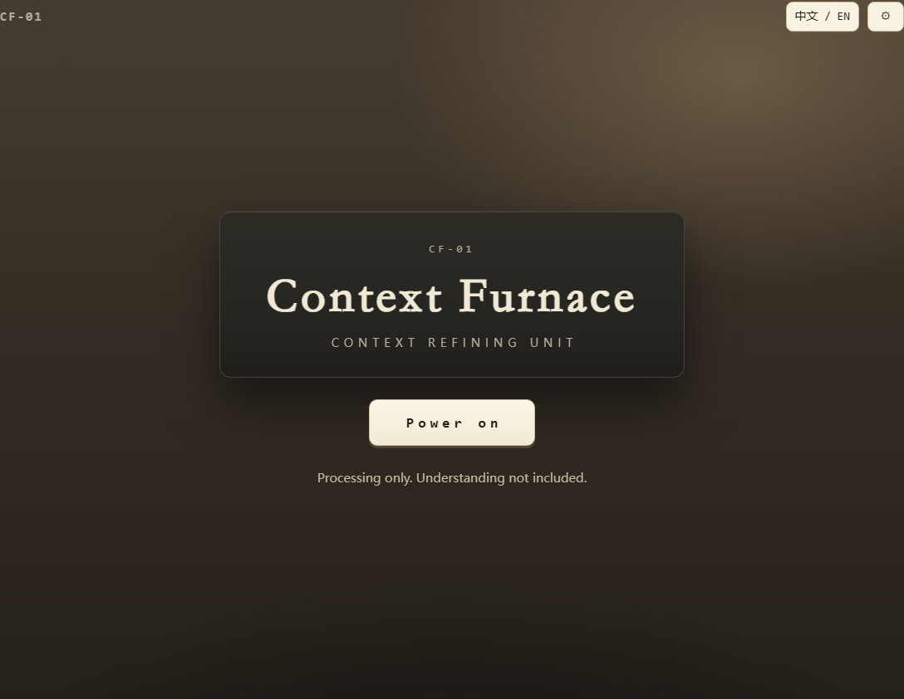

<div align="center">

# Context Furnace

**断章取火器 · CF-01**

A compact bilingual browser game built around a fictional text-processing machine.



[](https://rethymus.github.io/context-furnace/)
[](https://github.com/Rethymus/context-furnace/actions/workflows/ci.yml)
[](./LICENSE)

English | [简体中文](./README.zh-CN.md)

*Cut the feed. Adjust the gain. Keep the furnace running.*


</div>

## Play

**[Launch Context Furnace →](https://rethymus.github.io/context-furnace/)**

No installation, account, or network connection is required after the page has loaded.

## Overview

Context Furnace is a short single-page browser game.

Each cycle gives the machine a new text feed. Select a continuous section, adjust the gain, and send the resulting output into the furnace while balancing two operating values:

- **Heat** — keeps the machine running.
- **Fidelity** — tracks how closely the output remains connected to its input.

| | |
|---|---|
| **Session** | 12 cycles · a few minutes |
| **Languages** | 简体中文 · English |
| **Input** | Mouse, touch, or keyboard |
| **Audio** | Synthesized in the browser (Web Audio) — no audio files |

## How to Play

1. Press **Power on**.
2. In each cycle, move the two cutters to keep a continuous section of the feed. The section must contain the core statement.
3. Turn the **gain** knob (or press one of its stops) to change how the output is processed.
4. Watch the two gauges, then press **Ignite**. Ignited rounds cannot be undone.
5. Keep the furnace running for all 12 cycles.

## Screenshots

### Simplified Chinese

<p align="center">
  
</p>

### English

<p align="center">
  
</p>

## Controls

- **Mouse / touch** — drag the cutters, tap a track edge, or tap a gain stop.
- **Keyboard** — <kbd>Tab</kbd> to move focus, <kbd>←</kbd> / <kbd>→</kbd> to move a focused cutter or the gain, <kbd>Enter</kbd> / <kbd>Space</kbd> to activate, <kbd>Esc</kbd> closes settings.
- Sound and motion can be adjusted in Settings.

## Languages

- 简体中文 (zh-CN)
- English (en-US)

The language can be switched at any time from the header.

## Technology

- Vanilla TypeScript
- HTML and CSS
- Inline SVG
- Web Audio API
- Vite
- Vitest and Playwright

## Run Locally

```bash
npm ci
npm run dev
```

The production build outputs static files only:

```bash
npm run build
npm run preview
```

## Testing

```bash
npm run verify
```

This runs type checking, unit tests, a production build, browser end-to-end tests (Chromium, Firefox, WebKit), accessibility checks (WCAG 2.2 AA via axe), offline checks, a bundle-size budget, and presentation checks.

## Project Scope

Context Furnace is intentionally small:

- one screen
- one 12-cycle run
- no backend
- no accounts
- no analytics
- no external runtime services
- no AI or LLM dependency

## License

[MIT](./LICENSE)
