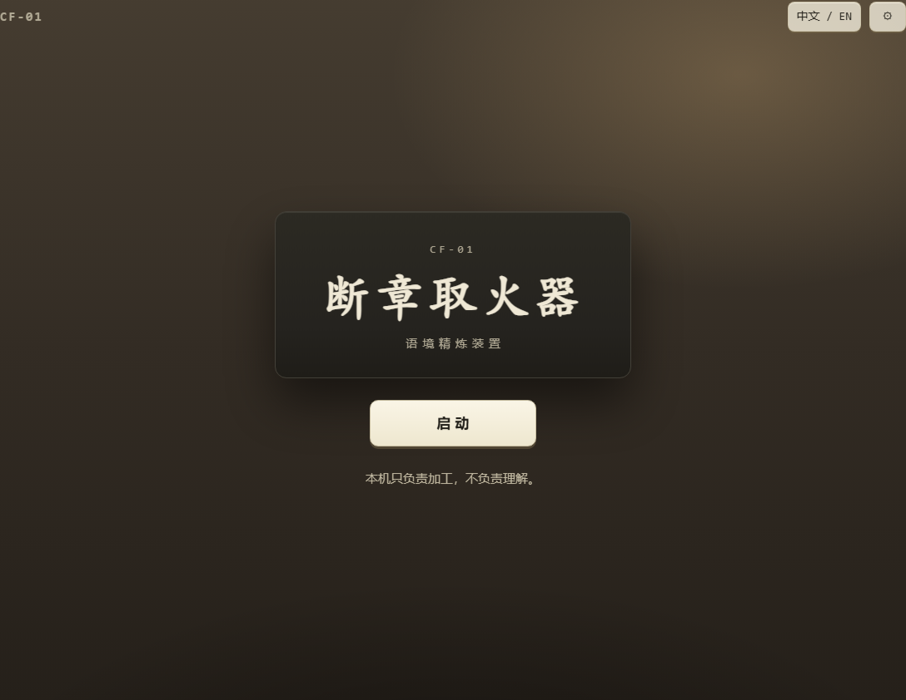
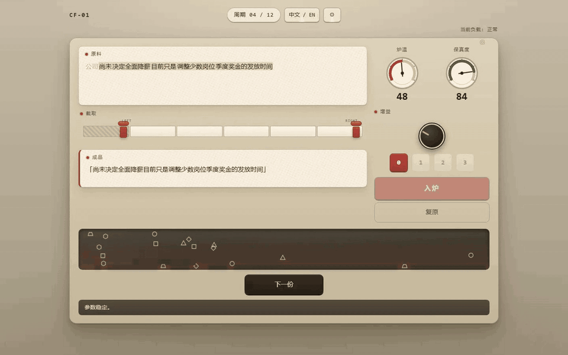
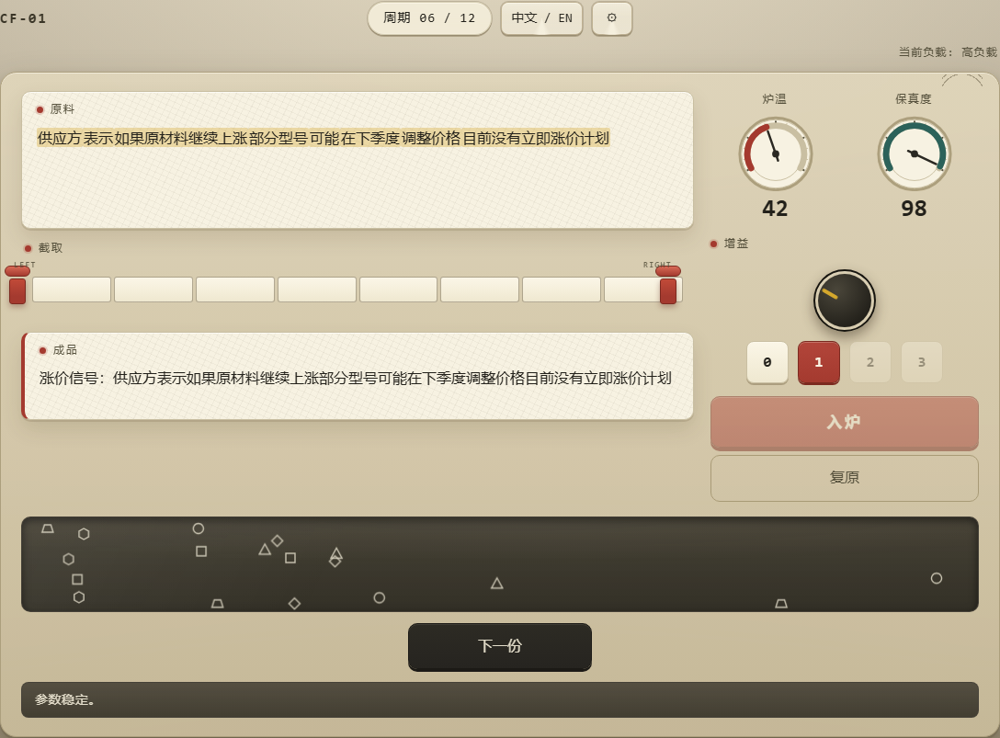
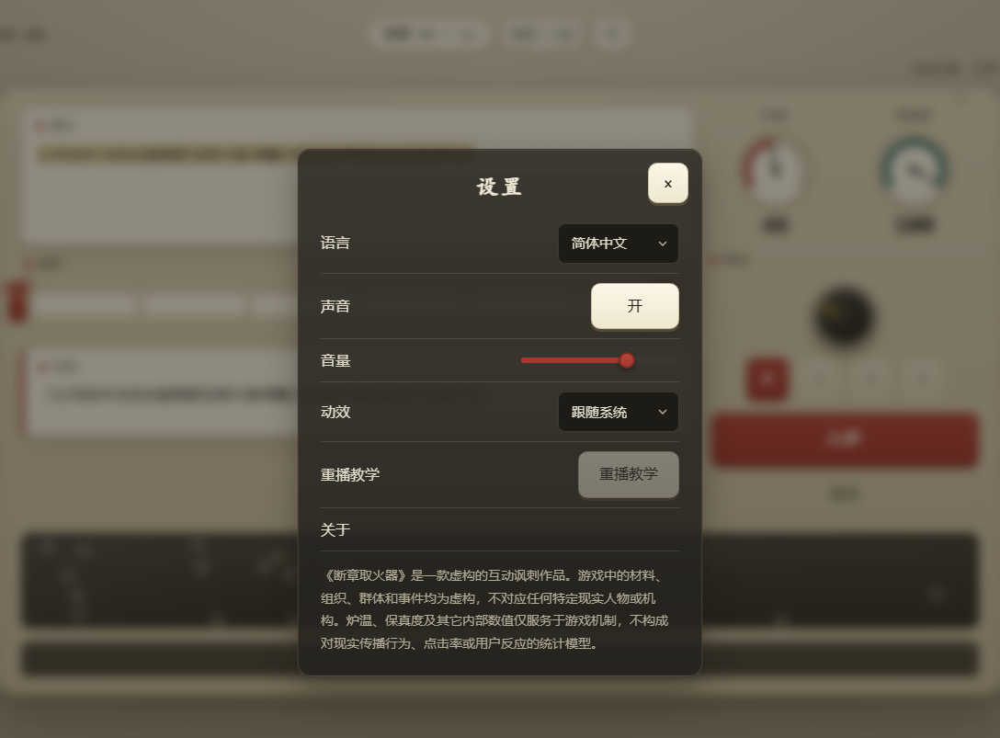
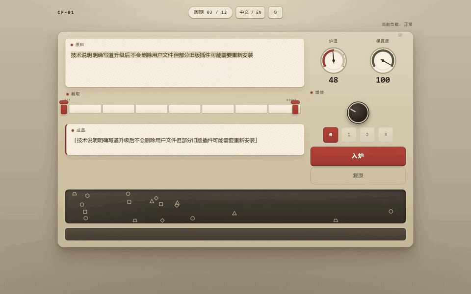

<div align="center">

# 断章取火器

**Context Furnace · CF-01**

一款围绕虚构文字加工设备展开的轻量级双语浏览器小游戏。



[](https://rethymus.github.io/context-furnace/)
[](https://github.com/Rethymus/context-furnace/actions/workflows/ci.yml)
[](./LICENSE)

[English](./README.md) | 简体中文

*截取原料，调节增益，让炉子继续运转。*



</div>

## 开始游戏

**[启动 CF-01 →](https://rethymus.github.io/context-furnace/)**

无需安装、注册或登录；页面加载完成后，游戏运行本身不依赖网络服务。

## 游戏简介

《断章取火器》是一款短流程单页浏览器小游戏。

每个周期，机器都会送入一份新的文字原料。你需要截取其中连续的一段，调整增益，再将成品投入炉中，同时维持两项运行参数：

- **炉温**：维持设备运转。
- **保真度**：反映输出与输入之间仍保留多少关联。

| | |
|---|---|
| **流程** | 12 个周期 · 几分钟 |
| **语言** | 简体中文 · English |
| **操作** | 鼠标 / 触摸 / 键盘 |
| **音频** | 浏览器内实时合成（Web Audio），无音频文件 |

## 怎么玩

1. 按下**启动**。
2. 每个周期中，移动两把裁刀，保留原料中连续的一段。所选片段必须包含核心表述。
3. 旋转**增益**旋钮（或直接点击卡位），改变成品被加工的方式。
4. 留意两项仪表，然后按下**入炉**。入炉后的周期无法撤销。
5. 让设备持续运转，完成全部 12 个周期。

## 游戏截图

<p align="center">
  
  
  
  
</p>

## 操作

| 输入 | 动作 |
|---|---|
| **鼠标 / 触摸** | 拖动裁刀、点击轨道边界，或直接点击增益卡位 |
| <kbd>Tab</kbd> | 移动焦点 |
| <kbd>←</kbd> / <kbd>→</kbd> | 移动聚焦的裁刀或增益档位 |
| <kbd>Enter</kbd> / <kbd>空格</kbd> | 确认 |
| <kbd>Esc</kbd> | 关闭设置 |

声音与动效可在设置中调整。

## 语言

- 简体中文（zh-CN）
- English（en-US）

可随时通过页面顶部按钮切换语言。

<p align="center">
  
</p>

## 技术栈

- 原生 TypeScript
- HTML 与 CSS
- 内联 SVG
- Web Audio API
- Vite
- Vitest 与 Playwright

## 本地运行

```bash
npm ci
npm run dev
```

生产构建只输出静态文件：

```bash
npm run build
npm run preview
```

## 测试

```bash
npm run verify
```

包含类型检查、单元测试、生产构建、浏览器端到端测试（Chromium、Firefox、WebKit）、无障碍检查（axe / WCAG 2.2 AA）、离线检查、体积预算与展示面检查。

## 项目范围

《断章取火器》刻意保持小巧：

- 单一界面
- 单次 12 周期流程
- 无后端
- 无账号
- 无统计埋点
- 无外部运行时服务
- 不依赖 AI 或 LLM

## 许可证

[MIT](./LICENSE)
